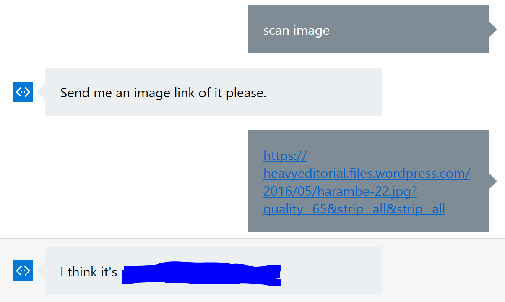

# Mission 3: Identifying an image using the Computer Vision API

## Introduction

We need a way to also identify any unknown objects that we find on Mars. Let's utilize the Computer Vision API to enable our bot to detect objects.

## Mission

- You'll need the Computer Vision API. [Here's](https://dev.projectoxford.ai/docs/services/56f91f2d778daf23d8ec6739/operations/56f91f2e778daf14a499e1fe) the API reference. Refer to it when building your options for the API call in your code. Retrieving the subscription keys is similar to how you did it for LUIS and the news search. 

- You also need add a new intent in LUIS to understand that your user wants an image.

The options for your API call should be in the following format:

```js
var options = {
            method: 'POST', // thie API call is a post request
            uri: '**REFER TO API REFERENCE AND FIND OUT THE API ENDPOINT**',
            headers: {
                'Ocp-Apim-Subscription-Key': '**YOUR BING COMPUTER VISION KEY**',
                'Content-Type': '**REFER TO API REFERENCE**'
            },
            body: {
                url: '**THE IMAGE URL PROVIDED BY THE USER**'
            },
            json: true
        }
```

Here's a simple dialog that asks the user for an image link.

```js
bot.dialog('/analyseImage', [
    function (session){
        builder.Prompts.text(session, "Send me an image link of it please.");
    },
    function (session,results){
        var inputUrl = results.response;
    }
]);
```

Next, we generate the options object for the request, using the user's URL.

```js
bot.dialog('/analyseImage', [
    function (session){
        builder.Prompts.text(session, "Send me an image link of it please.");
    },
    function (session,results){
        //Options for the request
        var options = {
            method: 'POST',
            uri: 'https://api.projectoxford.ai/vision/v1.0/describe?maxCandidates=1',
            headers: {
                'Ocp-Apim-Subscription-Key': BINGCVKEY,
                'Content-Type': 'application/json'
            },
            body: {
                //https://heavyeditorial.files.wordpress.com/2016/05/harambe-22.jpg?quality=65&strip=all&strip=all
                url: results.response
            },
            json: true
        }
    }
]);
```

Then, we can send the request using the options object we generated.

```js
bot.dialog('/analyseImage', [
    function (session){
        builder.Prompts.text(session, "Send me an image link of it please.");
    },
    function (session,results){
        //Options for the request
        var options = {
            method: 'POST',
            uri: 'https://api.projectoxford.ai/vision/v1.0/describe?maxCandidates=1',
            headers: {
                'Ocp-Apim-Subscription-Key': BINGCVKEY,
                'Content-Type': 'application/json'
            },
            body: {
                //https://heavyeditorial.files.wordpress.com/2016/05/harambe-22.jpg?quality=65&strip=all&strip=all
                url: results.response
            },
            json: true
        }
        //Make the request
        rp(options).then(function (body){
            // Send the caption
            session.send("I think it's " + body.description.captions[0].text)
        }).catch(function (err){
            console.log(err.message);
            session.send(prompts.msgError);
        }).finally(function () {
            session.endDialog();
        });
    }
]);
```

## Completion

### Once you think you've got it, put the following image links into your bot:
- http://cp91279.biography.com/1000509261001/1000509261001_2051017826001_Bio-Biography-Neil-Armstrong-SF.jpg
- http://cdn1us.denofgeek.com/sites/denofgeekus/files/styles/article_width/public/2016/01/millennium-falcon.jpg
- https://heavyeditorial.files.wordpress.com/2016/05/harambe-22.jpg

### The completed conversation if you complete this mission should look like this:


